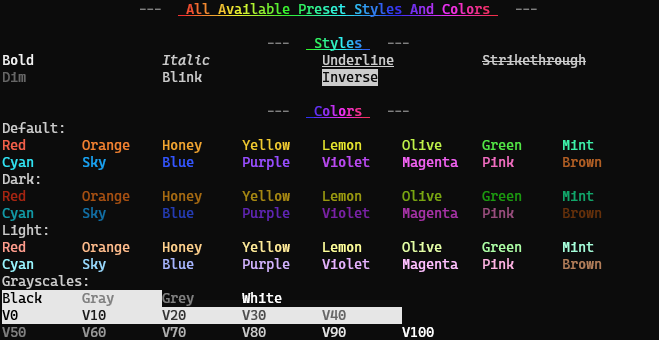

# @rewl/rainbow

True Color display in terminal with no fallback.

[](https://www.npmjs.com/package/@rewl/rainbow)
[](https://www.npmjs.com/package/@rewl/rainbow)

## Features

- No dependencies.
- Carefully chosen fancy colors.
- Correct nesting behavior.
- Type linting.
- Full unit test.
- Full in-file API documents with JSDoc.

## Caveats

- No detection on color support of console and no fallback.
- Performance is not optimized. If you care about it, consider using more lightweight library like [kleur](https://github.com/lukeed/kleur).
- Although `Node.js`-related module is not used, this library is mostly meant for terminal and does not test against consoles in web browsers.

## Showcase

<div align='center'>
  
</div>

This result is generated by running this [`show.js`](./show.js) script.

## Examples

```js
import r = require('@rewl/rainbow')

console.log(r.blue('Blue text'))

console.log(r.orange().bg.dark.blue('Orange text with dark blue background'))

console.log(r.u().rainbow('Rainbow text with underline color'))
```

## Chainable Methods

**Styles**, **Colors** and **Modifiers** are chainable.

**Styles** and **Colors** are functions.

- Calling them with no arguments continue the chaining.
- Calling them with a string would finish the chaining and return the rendered content.

**Modifiers** are getters and using them would always continue the chaining.

### Styles

These styles are supported, and some of them are given one-letter shortcuts:

```
bold (b), italic (i), underline (u), strikethrough (s)
dim, blink, inverse, hidden, reset
```

Styles can be nested.

```js
// The word 'italic' would be both underlined and italic.
console.log(r.u(`underlined ${r.i('italic')} text`))
```

Notably, `reset` would only reset the styles **inside** it.

```js
console.log(r.red(`Red text but ${r.reset('these texts are reset')} and these are not.`))
```

### Colors

These colors are presetted:

```
red, orange, honey, yellow, lemon, olive, green, mint
cyan, sky, blue, purple, violet, magenta, pink, brown

black, gray / grey (*1), white
v0, v10, v20, ..., v100 (*2)
```

**\*1** Both spellings are okay.

**\*2** `v` represents `value`, and those are colors where hue and saturation are 0 and value is as in their name. To be more specific, `v0` = `black`, `v50` = `gray` and `v100` = `white`.

Commonly used terminal color names are covered.

Like styles, colors can also be nested, and the color of the same field (text or background) would be overrided.

```js
// The word 'yellow' would have both yellow color and violet background.
console.log(r.bg.violet(`Violet background with ${r.yellow('yellow')} text inside`))

// The word 'blue' would be overrided to blue.
console.log(r.red(`Red text with ${r.blue('blue')} text inside`))
```

### Modifiers

There are currently three modifiers, **bg**, **dark** and **light**.

After a **Color** method is called, the state of **all modifiers** would be reset, and should be chained again if they are to be applied to next color call.

#### bg

`bg` would make the next color method applies to background.

```js
console.log(r.bg.red('Text with red background'))
```

#### dark

`dark` would make the next color method applies dark color (as shown in [showcase](#showcase)).

If a color does not have a dark version (e.g. grayscales), it would fall back to its default color.

It differs from `dim` that `dark` colors are chosen manually.

```js
console.log(r.dark.blue('Text with dark blue color'))
```

#### light

`light` would make the next color method applies light color (as shown in [showcase](#showcase)).

If a color does not have a light version (e.g. grayscales), it would fall back to its default color.

```js
console.log(r.light.pink('Text with light pink color'))
```

### Custom colors

Custom colors can be created using following methods:

### rgb(r, g, b)

### hsv(h, s, v)

## Non-chainable methods

These methods can only be the last method in the chain, and some [**Modifiers**](#modifiers) do not have effect on them.

### rainbow(content, options?)

Apply rainbow color to content using current style chaining.

[`bg`](#bg) modifier can be chained before this method.

```js
console.log(r.black().bg.rainbow('Black text with rainbow background'))
```

**options**: Options to customize the rainbow color.

- `offset: number | 'random'` (default: `0`): Offset of the starting hue. would be a random value if set to 'random'.

- `reverse: boolean` (default: `false`): Whether the direction of the spectrum should be reversed. The color would starts from red to orange if not reversed, and to purple if reversed.

- `span: number` (default: `360`): Hue span (in degree). The whole spectrum is used by default.

- `s: number` (default: `80`): Saturation.

- `v: value` (default: `95`): Value (or Brightness).

- `background: boolean` (default: `false`): Whether the rainbow color should be applied to the background or not. Has the same effect of [`bg`](#bg) modifier and would override it if provided directly.

### hash(content, options?)

Apply color according to the provided content.

The applied color would be the same if the content **and the options** are the same.

[`bg`](#bg) modifier can be chained before this method.

```js
const r1 = r.hash('The same text')
const r2 = r.hash('The same text')
r1 === r2 // true
```

**options**: Options to customize the result color.

- `s: number | [number, number]`: (default: `[60, 100]`) Saturation (or its possible range). **\*1**

- `v: number | [number, number]`: (default: `[80, 100]`) Value (or Brightness) (or its possible range). **\*1**

- `background: boolean` (default: `false`): Whether the color should be applied to the background or not. Has the same effect of [`bg`](#bg) modifier and would override it if provided directly.

**\*1** If a number is provided, the result color would have the specific saturation or value. If an array of two numbers (`[minValue, maxValue]`) is provided, the result color would be in the range of `minValue` and `maxValue` (both inclusive).

## Utilities

Some utilities are also exported in case they are needed.

### render(s: Segment)

The base renderer used in this module. The implementation is [here](./src/impl/render.ts).

### hsv2rgb(h: number, s: number, v: number)

Returns (`[number, number, number]`): Converted RGB value.

Convert HSV value to RGB value.

## About `@rewl`

[`@rewl`](https://github.com/rewljs) ("`re`inventing the `w`hee`l`") is a personal `npm` scope of [idlist](https://github.com/idlist).

What it does is literal. I believe that there should be other existing module(s) or package(s) that has done (and most of the time do far better than) what I'm doing, but for one reason or another, I decided to reinvent the wheel again. `@rewl` is the collection of those "wheels".

## License

MIT